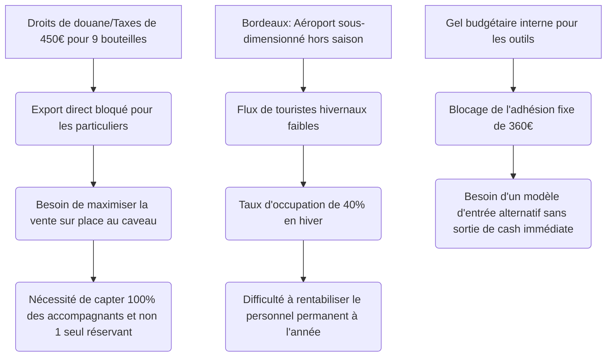

# Rapport Stratégique & Plan d'Action Commercial : Château Pont-Saint-Martin
> Réf. Document : [22 juin à 15-39.txt](file:///C:/Users/julien/OneDrive/Bureau/geminicli/super-agent-consulting/m%C3%A9moire/RDM%203.0/22%20juin%20%C3%A0%2015-39.txt)
> Date : 2026-06-22
> Version : 2.0 (Affinée & Augmentée)
> Auteur : Antigravity (Expert Stratégie & Croissance)

---

## 🎯 1. Analyse Structurelle & Chaîne Causale des Freins

Pour formuler des solutions à fort impact, il est indispensable de comprendre pourquoi le modèle actuel du Château Pont-Saint-Martin stagne sur certains aspects.



---

## ⚖️ 2. Confrontation : Besoins du Client vs Suggestions Apiouse Avancées

| Besoins Clés (Château) | Suggestions Classiques | Suggestions Avancées & Affinées (Apiouse) |
| :--- | :--- | :--- |
| **1. Vendre du vin sur place** (Export individuel bloqué). | Boutique en ligne et présentation des cuvées dans l'application. | **QR-Code Wine Bar & Conciergerie Coffre** : Chaque chambre dispose d'une cave de courtoisie. Le client scanne la bouteille ouverte sur l'app, le paiement est automatisé. Possibilité de commander 6 ou 12 caisses livrées directement dans le coffre du véhicule au check-out. |
| **2. Contourner les taxes d'export** (Pour les clients suisses/internationaux post-séjour). | Relances e-mail classiques pour acheter en ligne. | **Réseau de Distributeurs Géolocalisés** : L'app détecte le pays du client (ex. Suisse). Au lieu de livrer depuis la France, elle affiche : *"Profitez de nos bouteilles chez notre distributeur partenaire à Genève avec votre tarif Club Pont-Saint-Martin (-10%)"*. |
| **3. Capter la data des accompagnants** (36 logés, 1 seul email). | Demander de remplir une fiche papier à l'accueil. | **Livret d'Accueil Digital Collaboratif** : L'accès à la clé digitale, au code Wi-Fi et au guide d'activités nécessite le partage du lien d'invitation au groupe. Chaque accompagnant se connectant reçoit un ticket numérique pour une dégustation offerte en échange de son opt-in. |
| **4. Remplir l'hiver (40 % d'occupation)** (Coûts fixes du personnel permanent). | Référencement sur l'application et visibilité standard. | **Offres Corporate "Masterclass & Assemblage"** : Cibler les séminaires de direction en basse saison (négociants, entreprises régionales). Privatisation du Château avec atelier de création de sa propre cuvée de vin en hiver. |
| **5. Lancer les villas premium du Cap Ferret** (4k € à 10k €/semaine). | Ajouter les villas sur l'application comme second lieu. | **Pass VIP "Terre & Mer"** : Unification du parcours client. Le client des villas du Cap Ferret bénéficie d'une journée d'excursion oenotouristique privée avec chauffeur au Château Pont-Saint-Martin. Les deux bases de données fusionnent pour le cross-selling. |
| **6. Contourner le gel budgétaire** (Impossibilité d'engager 360 €). | Période d'essai classique ou réduction de prix. | **Contrat d'Échange (Barter Agreement)** : Financer la licence annuelle de 360 € en bouteilles de vin (ex. 12 à 18 bouteilles de prestige) à destination de notre réseau corporate ou comme récompenses pour les meilleurs voyageurs Apiouse. Zéro impact sur la trésorerie du Château. |

---

## 📈 3. Plan d'Action Commercial Multi-Touch

Pour maximiser les chances de closing, nous mettons en place un processus de vente en 4 étapes.

### Étape 1 : Le Pré-cadrage Visuel (La Démo)
Avant d'envoyer le mail, créer une pré-configuration (maquette) du profil du Château Pont-Saint-Martin dans notre base de staging. Ajouter 2 bouteilles emblématiques du domaine et les villas du Cap Ferret dans l'interface pour que l'interlocuteur se projette immédiatement.

### Étape 2 : L'Email d'Accroche Stratégique
*(Envoyé en début de semaine à Émilie avec copie au gérant)*

```markdown
Objet : Château Pont-Saint-Martin & Cap Ferret : Leviers de vente directe et synergies d'offres

Bonjour Émilie,

Ravi de notre échange de lundi. La vision pragmatique que vous portez pour le Château Pont-Saint-Martin et vos futurs développements immobiliers au Cap Ferret résonne parfaitement avec notre approche de la performance directe.

Pour faire suite à nos discussions, nous avons structuré une proposition sur-mesure répondant spécifiquement à vos contraintes mécaniques actuelles :

1. Maximiser la vente directe sur place : Face au blocage douanier de l'exportation individuelle (450 € pour 9 bouteilles vers la Suisse), l'enjeu est de capter l'achat impulsif pendant le séjour. Notre solution intègre un module "Click & Collect" en chambre (les clients scannent et commandent leurs bouteilles directement, livrées dans leur coffre au moment du départ).
2. Capter 100 % de votre base client : Vos 5 chambres accueillent des groupes et des accompagnants dont vous ne captez pas la data (actuellement bloquée par Booking/Expedia). Via notre livret d'accueil digital partagé (indispensable pour le Wi-Fi et les activités), vous enregistrez automatiquement les e-mails de tous les membres du groupe pour vos campagnes de réachat de vin.
3. Synergie Cap Ferret & Vignoble : Vos villas sur pilotis (4k € à 10k €/semaine) et le Château partagent la même cible CSP+. Nous mettons en place un forfait exclusif "Terre & Mer" (excursion privée au Château proposée d'office aux locataires du bassin), créant un canal de cross-selling hautement qualifié.
4. Rentabiliser la basse saison (hiver) : Nous intégrons vos offres dans notre catalogue d'affaires (séminaires de direction, négociants) via nos partenariats CE/CSE pour remonter vos 40 % d'occupation hivernale et amortir vos coûts de personnel permanent.

Alternative Budgétaire (Zéro Cash-out) :
Pour contourner le gel temporaire de vos budgets marketing, nous vous proposons un accord de "Barter" (échange de marchandises) : nous prenons en charge l'installation technique complète en échange d'une dotation équivalente en bouteilles de votre domaine pour nos événements corporate. Zéro sortie de trésorerie pour vous cette année.

Vous pouvez visualiser une première maquette de votre espace en téléchargeant l'application démo via ce lien : [Lien de démo]

Disponibles lundi ou mardi prochain pour un court point de validation et configurer vos accès ?

Bien cordialement,

Julien / Apiouse
```

### Étape 3 : La Relance Téléphonique & Traitement des Objections
*(48h à 72h après l'envoi de l'e-mail)*

* **Si l'interlocuteur insiste sur le manque de temps pour configurer l'outil** :
  > *"Nous prenons tout en charge. Vous nous envoyez vos photos et votre grille de tarifs de vin par simple photo WhatsApp, et nos équipes configurent votre boutique et vos villas en 48 heures. Votre seule action sera d'imprimer le QR code d'accueil que nous vous fournissons."*
* **Si le client doute du ROI de l'appli sur la vente de vin** :
  > *"Si l'outil vous permet de vendre seulement deux caisses de vin de plus par mois au caveau grâce aux accompagnants que vous ne captiez pas auparavant, vous doublez votre investissement annuel."*

### Étape 4 : La Contractualisation & Intégration
* Signature de la convention d'échange (Barter) ou de la franchise d'essai de 3 mois.
* Livraison du kit d'accueil physique (plaquettes de table en bois gravées avec QR code pour les chambres).
* Synchronisation avec le PMS interne du Château pour automatiser l'envoi du lien d'invitation à J-3 du séjour.

---

## 📊 4. Matrice de Pilotage : Risques & Indicateurs de Succès

| Risque Identifié | Probabilité (1-5) | Gravité (1-5) | Plan de Contingence (Apiouse) | KPI de Suivi |
| :--- | :--- | :--- | :--- | :--- |
| **Faible adoption par le personnel sur place** (pas de promotion de l'app). | 3 | 4 | Fournir des supports physiques (plaquettes de table) qui incitent le client à scanner sans intervention du personnel. | % de téléchargements / nombre de réservations réelles (Cible > 80%). |
| **Complexité logistique pour les villas du Cap Ferret** (distance de gestion). | 2 | 3 | Centralisation des deux fiches hébergements sur le même tableau de bord Apiouse pour le gestionnaire. | Nombre de réservations croisées Château <-> Cap Ferret. |
| **Blocage sur le transport local hivernal** (difficultés de déplacement des clients d'affaires). | 4 | 3 | Nouer un partenariat avec un service de chauffeurs VTC locaux bordelais pour proposer des packages clés en main séminaires + transport. | Nombre de packs séminaires d'hiver vendus. |

---

## 🎯 5. Questions d'Itération pour Affiner ce Plan de Croissance
1. Le deal d'échange (Barter) en bouteilles de vin vous semble-t-il être le levier le plus puissant pour contourner leur gel de budget, ou devrions-nous plutôt proposer une gratuité totale de 6 mois ?
2. Souhaitez-vous que nous contactions directement un partenaire de transport privé à Bordeaux pour l'intégrer dans le chiffrage du package séminaire d'hiver ?
3. Devons-nous planifier la création d'une maquette graphique haute définition des plaquettes de table en bois gravées (kit d'accueil physique) pour la joindre en pièce jointe du mail ?
