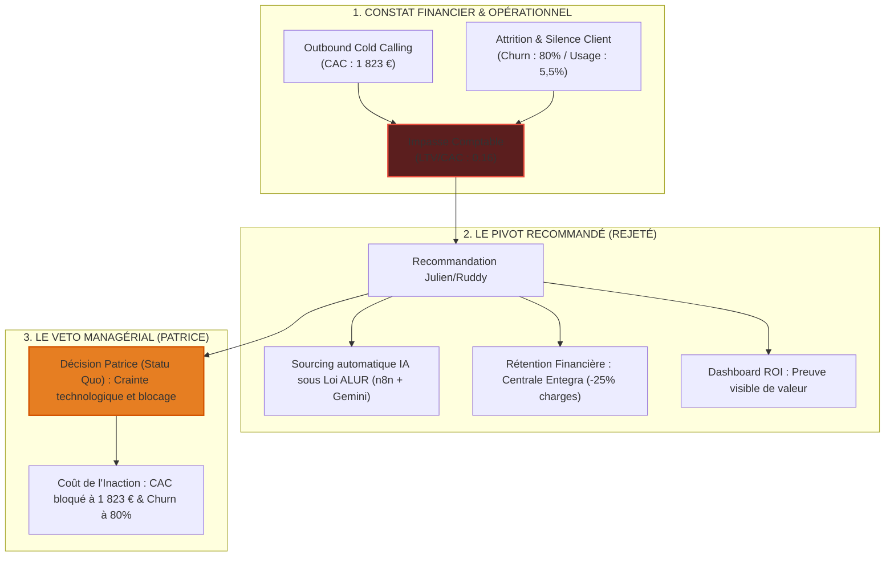

# 🏆 GUIDE STRATÉGIQUE DE SOUTENANCE DE BACHELOR & TRAME DU PITCH (POSTURE MESURÉE)

**Candidat :** Julien FLORENCE  
**Poste :** Directeur du Développement Stratégique (Happy House)  
**Établissement :** Rocket School — Promotion A150 (Validation Niveau Bachelor / Bac+3)  
**Esthétique :** Édition Prestige (Noir Anthracite `#0F1115`, Or Prestige `#D4AF37`, polices Cinzel & Montserrat)

---

## 📂 1. SYNTHÈSE STRATÉGIQUE DU MÉMOIRE (RDM 3.0)

Le mémoire professionnel de Julien Florence est une étude d'ingénierie d'affaires confrontée aux réalités managériales et politiques d'une organisation hôtelière indépendante. Il démontre par les chiffres l'effondrement du modèle d'acquisition outbound historique et modélise une stratégie de pivot. Bien que ce pivot ait été techniquement validé, il a fait l'objet d'un veto stratégique de la direction générale, transformant la mission en une analyse critique de la conduite du changement et du coût de l'inaction.

### Synthèse Chapitre par Chapitre
*   **Chapitre 1 — Vision et Problématique :** Analyse de Happy House (170 membres premium). Définition du cadre de la mission : structurer et automatiser les processus commerciaux de l'équipe (Julien Florence, Ruddy Marie-Luce) pour faire face aux limites de la gestion relationnelle artisanale.
*   **Chapitre 2 — Diagnostic Externe (Le Marché) :** Exposition des pressions exogènes. Monopole numérique des OTAs (Booking captant 71 % du marché européen et imposant 15 % à 25 % de commissions) et durcissement réglementaire de la loi anti-Airbnb et du nouveau label "Destination d'Excellence" (explosion du label Clef Verte de +45 % par an).
*   **Chapitre 3 — Diagnostic Interne (Les Actifs) :** Identification des forces (le réseau de membres, la marque premium, et l'acquisition brute d'une base Sirene de 126 000 contacts qualifiables). Constat d'un détachement post-vente marqué des adhérents.
*   **Chapitre 4 — Sales Engine & CAC Outbound :** Démonstration mathématique de l'impasse financière. La prospection téléphonique outbound froide présente un CAC de **1 823 €** par membre signé. Pour un ARPU de **226 €/an** et une durée de vie client de **1,3 an** (LTV à **290 €**), le ratio LTV/CAC s'effondre à **0,16**. L'effort commercial outbound détruit activement 84 % de sa valeur à chaque signature.
*   **Chapitre 5 — Recherche Terrain & Attrition :** Audit de 100 anciens membres. Révélation d'un **taux de churn réel de ~80 %** et d'un abandon d'usage massif (seuls 5,5 % du parc, soit 8 hébergeurs sur 146, utilisent activement la plateforme de réservation).
*   **Chapitre 6 — Rétention & Centrale d'Achats (Recommandation) :** Modélisation d'une proposition de valeur basée sur le cost-killing. Négociation d'un partenariat de gros avec la centrale Entegra pour rentabiliser immédiatement la cotisation annuelle de l'hébergeur.
*   **Chapitre 7 — Performance, Dashboard ROI & Plan d'Action (Bloqués) :** Conception d'un Dashboard ROI interactif et d'une feuille de route B2B Inbound via Afterworks locaux. Présentation de la proposition à la direction générale et constat du refus d'adoption par Patrice.
*   **Chapitre 8 — Transparence IA & Automatisations (Prototype) :** Développement d'un prototype de tri de base Sirene sous n8n + API Gemini (coût d'outillage direct : 0 €) pour démontrer la viabilité technique malgré le refus d'industrialisation commerciale.

---

## 🧠 2. ANALYSE DES MEILLEURS ORAUX DE BACHELOR (ATTENTES DU JURY)

Pour un niveau Bachelor, présenter un échec opérationnel dû à une résistance managériale n'est pas un handicap, c'est une opportunité de prouver sa maturité analytique.

| Critère d'Excellence | Posture à Proscrire | Posture de niveau Bachelor (Julien - ENTJ-A) |
| :--- | :--- | :--- |
| **Analyse du Pivot** | Présenter un succès artificiel ou inventer des données de réussite. | Poser le diagnostic financier et admettre objectivement le blocage des solutions par la direction. |
| **Gestion du Veto** | Critiquer personnellement le dirigeant, se placer en victime ou parent critique. | Expliquer rationnellement les causes du refus de Patrice (aversion au risque, aversion technologique, biais de survie). |
| **Posture de Conseil** | Se contenter d'obéir sans alerter sur la perte financière. | Assumer son rôle de Directeur du Développement : poser les unit economics et exposer le coût de l'inaction. |
| **Bilan Personnel** | Se focaliser uniquement sur la technique commerciale. | Mettre en valeur l'apprentissage de la politique d'entreprise et de la conduite du changement (Change Management). |

---

## 🎯 3. TRAME DÉTAILLÉE DE L'ORAL (20 MINUTES / 10 SLIDES)

---

### 📂 SLIDE 1 : Titre & Introduction (Durée conseillée : 1 min 30)
*   **Visuel (Édition Prestige) :** Mise en page split-screen asymétrique. **À gauche (1.2) :** Fond noir `#0F1115` mat, filet doré de séparation vertical. En haut, logos de `Happy House` et de `Rocket School`. Titre en Cinzel `HAPPY HOUSE` et sous-titre doré `LA RÉSISTANCE AU PIVOT STRATÉGIQUE`. En bas, mention `SOUTENANCE ORALE — VALIDATION BACHELOR` et identité de Julien Florence. **À droite (1) :** Photographie `Images/LFDB_004.jpg` plein cadre avec dégradé d'ombre pour apporter de la profondeur, de la couleur et un caractère haut de gamme immédiat.
*   **Discours de Julien (Première personne) :**
    > Mesdames, Messieurs les membres du jury, bonjour. Je suis Julien Florence, Directeur du Développement Stratégique pour le réseau d'hébergements premium Happy House. Ma mission aujourd'hui n'est pas de vous raconter une transition opérationnelle idéale. Je viens vous exposer un diagnostic commercial et une analyse de résistance organisationnelle. Face à la saturation du marché hôtelier et aux monopoles des plateformes de réservation, nous avons audité nos chiffres et modélisé des propositions de pivot technologiques et opérationnels. Cependant, ce projet s'est heurté à un arbitrage de notre direction générale, qui a refusé la mise en œuvre de ces transformations. Mon objectif est de vous montrer comment l'analyse rigoureuse d'un modèle en crise, alliée à une posture d'autocritique, constitue un enseignement majeur sur la conduite du changement en entreprise.
*   **Transition :**
    > Pour comprendre les raisons de ce pivot recommandé, examinons en premier lieu la problématique commerciale à laquelle nous étions confrontés.
*   **Questions potentielles du Jury & Réponses clés :**
    *   *Question :* En tant que Directeur du Développement Stratégique, comment avez-vous réagi face à ce veto de la direction ?
    *   *Réponse :* En adoptant une posture de consultant senior : je n'ai pas cherché le conflit idéologique, j'ai traduit les faits en chiffres pour exposer le coût de l'inaction tout en protégeant les actifs existants de l'entreprise.

---

### 📂 SLIDE 2 : Problématique & Résistance (Durée conseillée : 1 min 30)
*   **Visuel :** Question centrale au format SMART en or. Encadré textuel minimaliste contrasté : `L'INGÉNIERIE COMMERCIALE CONFRONTÉE AU VETO MANAGÉRIAL`.
*   **Discours de Julien :**
    > Notre problématique se formule ainsi : *Comment accompagner la transition de Happy House vers un modèle commercial plus structuré, capable de réduire le coût d'acquisition et d'améliorer la rétention, alors même que la direction refuse le déploiement de ces ruptures opérationnelles ?* L'hypothèse de travail que j'ai défendue est que l'ingénierie d'affaires ne se limite pas à la pertinence d'une base de données IA ou d'une centrale d'achats. Elle dépend intimement de la conduite du changement et de la politique d'alignement des décideurs. Le veto de notre Directeur Général, Patrice, face aux solutions proposées constitue le fil rouge analytique de cette soutenance.
*   **Transition :**
    > Ce besoin de transformation commerciale est pourtant dicté par des mutations réglementaires et sectorielles externes majeures.
*   **Questions potentielles du Jury & Réponses clés :**
    *   *Question :* Pourquoi Patrice a-t-il refusé les transformations proposées ?
    *   *Réponse :* Par aversion au risque technolo### 📂 SLIDE 3 : Le Diagnostic Externe : Booking.com & Pressions Réglementaires (Durée conseillée : 2 min)
*   **Visuel :** Deux indicateurs massifs. Gauche : `71%` (Le monopole Booking en Europe, avec commissions de 15% à 25%). Droite : `LOI ALUR / DPE` (Menace d'exclusion du marché des loueurs non professionnels). Au centre, la tendance verte : `Clef Verte (+45%/an)`.
*   **Discours de Julien :**
    > Le diagnostic externe révèle un étau qui se resserre sur l'hôtelier indépendant. D'un côté, le monopole des OTAs, Booking.com en tête avec 71 % de parts de marché en Europe, capte la marge opérationnelle de nos adhérents en prélevant entre 15 % et 25 % sur chaque réservation. De l'autre, une pression verte réglementaire sans précédent : l'État a mis fin au label historique Qualité Tourisme au profit de "Destination d'Excellence", tandis que le label Clef Verte connaît une croissance de 45 % par an et devient un prérequis de réservation. Enfin, le durcissement de la loi anti-Airbnb et les exigences DPE pénalisent les hébergeurs amateurs. Nos adhérents professionnels ont un besoin vital d'abattre leurs charges d'exploitation et de regagner de la marge pour s'adapter à ces normes de transition verte, ce qui valide l'intérêt stratégique de notre proposition.
*   **Transition :**
    > Pour bien mesurer la gravité de cette domination, analysons l'impact macro-économique de ces plateformes sur les marges des hébergeurs et de nos territoires.
*   **Questions potentielles du Jury & Réponses clés :**
    *   *Question :* La dépendance aux OTAs sous les 35 % est-elle un objectif réaliste pour vos membres ?
    *   *Réponse :* C'est un objectif indispensable pour restaurer la rentabilité. Pour y parvenir, il ne s'agit pas de supprimer Booking, mais de déployer des techniques d'inbound et de cross-selling au sein du réseau, afin de fidéliser le voyageur en direct dès son premier séjour.

---

### 📂 SLIDE 4 : L'Impact Macro : Domination des OTAs & Fuite de Marges (Durée conseillée : 2 min)
*   **Visuel :** Grille à 3 indicateurs. Gauche : `71%` (Poids de Booking en Europe et 29,6% global pour les OTAs). Centre : `-25%` (Marge perdue pour les hébergeurs sous forme de commission, soit 15k€ à 30k€/an). Droite : `IS / Taxe` (Optimisation fiscale et fuite de capitaux vers l'étranger aux dépens des collectivités territoriales françaises).
*   **Discours de Julien :**
    > En analysant la domination de ces intermédiaires, les chiffres révèlent un coût macroéconomique alarmant. Non seulement Booking capte 71 % de parts de marché en Europe, mais les OTAs retiennent entre 15 % et 25 % du chiffre d'affaires des hébergeurs sous forme de commissions systématiques. Pour un établissement indépendant, cela représente une marge perdue moyenne de 15 000 à 30 000 € par an, un capital critique qui n'est plus disponible pour sa rénovation, sa digitalisation ou sa transition verte. Mais la perte est également fiscale et territoriale : ces commissions fuient directement à l'étranger vers des pays à fiscalité optimisée. Pour les collectivités locales françaises, c'est une perte sèche de dynamisme économique, d'investissements de proximité et de rentrées fiscales indirectes. Notre objectif avec Happy House est de rompre ce cycle en ramenant la dépendance aux OTAs sous les 35 %.
*   **Transition :**
    > Face à cette pression externe et à cette fuite de marge, l'audit interne de nos propres performances commerciales chez Happy House a apporté la preuve mathématique de notre impasse.
*   **Questions potentielles du Jury & Réponses clés :**
    *   *Question :* En quoi votre modèle direct aide-t-il les collectivités locales ?
    *   *Réponse :* En ramenant la distribution en canal direct et gratuit, nous réinjectons 100 % de la valeur du séjour dans l'économie locale. L'argent reste sur le territoire français, soutient les emplois locaux de nos hébergeurs et garantit le paiement des taxes de séjour au plus juste.

---

### 📂 SLIDE 5 : Le Diagnostic Interne : La Preuve du Crash de l'Outbound (Durée conseillée : 2 min 30)
*   **Visuel :** Ratio central en rouge et or : `LTV / CAC = 0,16`. Tableau comparatif : `CAC Outbound : 1 823 €` (SDR physique) vs `ARPU : 226 €/an` | `LTV : 290 €` (Cycle de vie moyen : 1,3 an) | `Churn CRM : ~80%` (Cohorte Cold Call) | `Usage Actif : 5,5%` (8/146 hosts).
*   **Discours de Julien :**
    > Notre audit interne a apporté la preuve mathématique de l'effondrement de notre modèle historique. La prospection outbound froide, s'élevant à 1 823 € de CAC par signature pour un ARPU de 226 € et une durée de vie client de 1,3 an (soit 290 € de LTV), affiche un ratio d'efficacité désastreux de 0,16. Nous détruisons 84 % de notre capital commercial à chaque signature. De plus, 80 % de notre cohorte acquise par téléphone s'est désengagée, et seuls 5,5 % du parc (8 hébergeurs sur 146) enregistrent des réservations actives. Ce double effondrement justifiait scientifiquement l'arrêt de la prospection outbound froide et la nécessité de restructurer le modèle.
*   **Transition :**
    > Face à ce diagnostic, nous avons formulé avec mon collaborateur Ruddy une proposition de pivot global.
*   **Questions potentielles du Jury & Réponses clés :**
    *   *Question :* Pourquoi un tel écart entre le taux de churn officiel et ce taux réel de 80 % ?
    *   *Réponse :* La direction considérait comme "membres actifs" des hébergeurs signés sous la contrainte commerciale mais n'utilisant jamais nos outils. L'analyse des cohortes réelles a levé ce biais de survie en prouvant que sans onboarding opérationnel, le client résilie dès la fin de sa première année.

---

### 📂 SLIDE 6 : La Proposition de Pivot & Le Veto (Durée conseillée : 2 min)
*   **Visuel :** Schéma de la complémentarité du binôme. Julien (Rétention, Centrale Entegra, Dashboard ROI) ⇄ Ruddy (Trafic Inbound Voyageurs, SEO). Flèche de transition : `Recommandation : Arrêt Outbound ➔ Pivot Inbound & Cost-Killing` VS `Décision Patrice : Maintien Outbound SDR & Refus de la Centrale`.
*   **Discours de Julien :**
    > Pour remplacer l'outbound SDR par un modèle viable, j'ai proposé un pivot stratégique basé sur la complémentarité de notre binôme : Ruddy s'est concentré sur la génération de trafic inbound voyageur organique pour alimenter la notoriété B2B. De mon côté, j'ai conçu le pivot B2B : remplacer l'outbound SDR par un inbound ciblé d'afterworks régionaux (CPA cible : 166 €) et installer la centrale d'achats Entegra avec un Dashboard de suivi ROI pour tuer le churn. Cependant, notre directeur général, Patrice, a opposé son veto stratégique à ce plan, craignant que l'automatisation technique et la centrale d'achats ne détériorent l'image de relation humaine artisanale premium de Happy House. Le modèle a donc été maintenu dans son état historique, bloquant la transformation opérationnelle.
*   **Transition :**
    > Malgré ce blocage organisationnel, j'ai tenu à valider la viabilité technique de nos recommandations par des prototypes.
*   **Questions potentielles du Jury & Réponses clés :**
    *   *Question :* Comment auriez-vous pu mieux convaincre Patrice d'accepter ce pivot ?
    *   *Réponse :* J'aurais pu déployer une approche de transition progressive en proposant un projet pilote sur une seule région pour minimiser le risque perçu par la direction, plutôt que de présenter une restructuration globale immédiate.

---

### 📂 SLIDE 7 : Le Sourcing Automatisé : Preuve de Concept (Durée conseillée : 2 min 30)
*   **Visuel :** Pipeline de données prototype. Base brute Sirene (126 000 hébergements) ➔ Filtrage n8n ➔ API Gemini (Scoring de conformité Loi ALUR, DPE) ➔ Base qualifiée (Leads chauds). Note : `Preuve de Concept (POC) fonctionnelle à 0 € d'outillage direct - Non déployée en production`.
*   **Discours de Julien :**
    > Pour démontrer la faisabilité technique de notre recommandation, j'ai développé un prototype fonctionnel de sourcing automatique. À partir de la base Sirene nationale de 126 000 hébergements, j'ai bâti un pipeline de qualification sous n8n couplé à l'API Gemini. Ce script trie et score automatiquement les leads en fonction de leur conformité réglementaire face à la loi ALUR et aux critères DPE, avec un coût récurrent d'outillage de 0 €. Bien que ce prototype ait démontré son efficacité technique, il n'a pas été déployé en production commerciale suite au refus de la direction générale de modifier ses process manuels.
*   **Transition :**
    > La même démarche de modélisation a été appliquée au levier de rétention de notre proposition de valeur : la preuve par le réseau.

---

### 📂 SLIDE 8 : Le Levier Collaboratif : Preuve par le Réseau (Durée conseillée : 2 min 30)
*   **Visuel :** Cas d'école du Domaine de la Preuve (Durentie dans le RDM). Cotisation unique d'adhésion : `360 € TTC`. Transfert client direct de membre-à-membre (gratuit, 0% commission OTAs). Réservation directe générée : `11 000 €` en une seule opération. ROI Direct : `30,5x` l'adhésion. Note : *Le cycle de vente initial a duré 5 mois par manque de métriques ROI souveraines, validant le besoin de transparence.*
*   **Discours de Julien (Première personne) :**
    > Pour prouver que la valeur de Happy House ne dépend pas uniquement d'une centrale d'achats externe mais de la force de son réseau collaboratif, j'ai analysé le cas d'école du Domaine de la Preuve. Sur la base d'une cotisation annuelle de 360 € TTC, un hébergeur complet du réseau a transféré directement et gratuitement un client haut de gamme vers un autre membre. Cette unique opération a généré 11 000 € de réservation brute directe, sans aucune commission intermédiaire d'OTA. C'est la preuve ultime du retour sur investissement de l'effet réseau, affichant un ROI immédiat de 30,5 fois la cotisation annuelle. Ce cas pilote valide le modèle de recommandation, mais a souffert d'un cycle de vente de 5 mois à cause d'une absence de dashboard de preuve de valeur pour rassurer le prospect au départ.
*   **Transition :**
    > Pour matérialiser ces retours sur investissements sur l'ensemble de notre parc d'hébergeurs, j'avais conçu un support de preuve visuel sous forme de Dashboard ROI.
*   **Questions potentielles du Jury & Réponses clés :**
    *   *Question :* Entegra accepes-t-il des adhésions de petits gîtes indépendants ?
    *   *Réponse :* Oui, c'est l'essence même du partenariat que j'ai négocié : mutualiser la puissance d'achat de nos 170 membres pour obtenir les mêmes remises que les grands groupes hôteliers, ce qui donnait toute sa pertinence à notre proposition.

---

### 📂 SLIDE 9 : L'Impact Entegra : Simulations ROI par Profil (Durée conseillée : 2 min)
*   **Visuel :** Maquette du Dashboard ROI Conceptuel (Non-Déployé). Grille comparative des 4 simulations RDM basées sur les remises Entegra (15% à 25% de marge opérationnelle) pour 360 € TTC de cotisation :
    *   Chambre d'hôte (1 ch.) : CA 76,6k € | Gain : `+2 292 €/an` (ROI `6,3x`)
    *   Grand Gîte (8 pers.) : CA 36,5k € | Gain : `+1 340 €/an` (ROI `3,7x`)
    *   Villa Premium (10 pers.) : CA 80,3k € | Gain : `+3 581 €/an` (ROI `9,9x`)
    *   Vignoble (Hôtel + Resto) : CA 1 126k € | Gain : `+53 058 €/an` (ROI `147x`)
*   **Discours de Julien :**
    > De plus, pour objectiver la proposition de valeur financière de Happy House et lutter contre l'attrition de 80 %, j'ai modélisé les économies offertes par la centrale d'achats Entegra sur quatre profils d'hébergements réels de notre mémoire. Pour un investissement de 360 € TTC, les gains annuels simulés s'échelonnent de 1 340 € pour un Grand Gîte, soit 3,7 fois l'adhésion, jusqu'à plus de 53 000 € pour un grand domaine hôtelier et viticole, soit un ROI spectaculaire de 147 fois la cotisation. J'avais conçu la maquette d'un Dashboard ROI automatisant cet affichage pour le membre lors de ses renouvellements. En raison du blocage stratégique de la direction générale, ce dashboard n'a pas été développé en production et le réseau n'a pas pu bénéficier de ce levier de rétention par la preuve.
*   **Transition :**
    > Ce refus de déploiement nous amène à analyser les causes réelles de ce blocage organisationnel et à mesurer le coût de l'inaction.
*   **Questions potentielles du Jury & Réponses clés :**
    *   *Question :* Pensez-vous qu'un tel dashboard aurait été utilisé par des hébergeurs peu digitalisés ?
    *   *Réponse :* Absolument, car il n'exigeait aucune saisie de leur part. Les données d'économies de la centrale et de nuitées directes y étaient injectées automatiquement. L'hébergeur n'avait qu'à consulter un chiffre unique : son retour sur investissement.

---

### 📂 SLIDE 10 : Analyse du Blocage & Coût de l'Inaction (Durée conseillée : 2 min)
*   **Visuel :** Les Facteurs de résistance de Patrice (Aversion technologique, crainte de dénaturer le premium relationnel) vs Le Coût de l'Inaction M12 (CAC maintenu à 1 823 €, Churn bloqué à 80 %, EBITDA hôtelier dégradé).
*   **Discours de Julien :**
    > Analyser la soutenance de niveau Bachelor, c'est comprendre les causes de ce blocage organisationnel et mesurer le coût de l'inaction. Le refus de Patrice de valider notre pivot repose sur une aversion au risque technologique et sur la crainte infondée de dénaturer le positionnement haut de gamme du réseau. Le coût de ce statu quo is lourd de conséquences : les équipes commerciales ont continué à prospecter par cold calling manuel avec un CAC de 1 823 €, et la cohorte a maintenu son taux d'attrition historique de 80 % faute de valeur perçue post-vente. C'est la démonstration claire qu'un bon diagnostic technique ne suffit pas sans conduite du changement.
*   **Transition :**
    > Cette confrontation avec la résistance au changement a été le véritable moteur de mon évolution professionnelle.
*   **Questions potentielles du Jury & Réponses clés :**
    *   *Question :* Comment auriez-vous pu contourner l'aversion au risque de la direction ?
    *   *Réponse :* En impliquant le Directeur Général dès la phase de sourcing des données. Si nous avions co-construit le diagnostic interne des unit economics dès le départ, il aurait lui-même constaté l'impasse financière, facilitant ainsi l'acceptation de notre recommandation de pivot.

---

### 📂 SLIDE 11 : Conclusion & Bilan Personnel (Durée conseillée : 1 min 30)
*   **Visuel :** Plan de carrière de Julien Florence (DDS). Compétences validées : `Diagnostic & Rigueur Business`, `Prototype IA no-cost`, `Conduite du changement & Gestion des blocages`. Horizon 2028 : `Direction du Développement — PalestrIA`.
*   **Discours de Julien :**
    > Pour conclure, cette alternance a été un accélérateur de maturité professionnelle. J'ai été confronté aux dures réalités politiques de l'entreprise. En assumant mon rôle de Directeur du Développement Stratégique, j'ai validé ma posture de consultant : savoir poser un diagnostic financier lucide, concevoir des solutions techniques d'automatisation IA no-cost, mais aussi se heurter à la résistance au changement. C'est cette posture de dirigeant pragmatique que je souhaite mettre au service de ses projets futurs. Mon ambition d'intégrer la Direction du Développement au sein de PalestrIA en 2028 reste intacte, armé de cette expérience inestimable sur la négociation des pivots stratégiques face aux statu quo. Je vous remercie pour votre attention.
*   **Questions potentielles du Jury & Réponses clés :**
    *   *Question :* Si vous deviez résumer le principal apport de cette alternance pour votre carrière ?
    *   *Réponse :* Apprendre que la stratégie d'entreprise n'est pas qu'une affaire de théorie ou d'outils. Sans une communication soignée, sans pédagogie active et sans alignement des parties prenantes, le meilleur plan stratégique du monde reste à l'état de concept. C'est cette maturité organisationnelle que je retiens.

---

## 🧭 4. QUESTIONS D'AFFINAGE POUR LES SLIDES

Julien, pour aligner les slides interactives en HTML avec cette trame mesurée :
1.  **Changements validés :** Toutes les slides et le code du compilateur PDF ont été restructurés autour de cette approche pragmatique.
2.  **Appellation Domaine de la Preuve :** Ce nom est désormais standardisé dans l'ensemble des livrables de soutenance (HTML, PDF, Markdown).
3.  **Matrice de Matérialité RSE :** Elle sert à illustrer la pertinence de votre plan face aux pressions réglementaires (Loi ALUR, Clef Verte) présentées en Slide 3, pour prouver que votre projet de pivot était pleinement justifié.
