# 🏆 GUIDE STRATÉGIQUE DE SOUTENANCE DE MASTER & TRAME DU PITCH

**Candidat :** Julien FLORENCE  
**Poste :** Directeur du Développement Stratégique (Happy House)  
**Établissement :** Rocket School — Promotion A150 (Validation Niveau Master / Bac+5)  
**Esthétique :** Édition Prestige (Noir Anthracite `#0F1115`, Or Prestige `#D4AF37`, polices Cinzel & Montserrat)

---

## 📂 1. SYNTHÈSE STRATÉGIQUE DU MÉMOIRE (RDM 3.0)

Le mémoire professionnel de Julien Florence est une démonstration d'ingénierie d'affaires appliquée à l'hôtellerie indépendante. Face à la saturation des canaux d'acquisition et au resserrement des marges hôtelières, il propose une restructuration globale de la proposition de valeur et des processus de Happy House.

```mermaid
graph TD
    subgraph Diagnostic ["1. LE CONSTAT DE SATURATION"]
        A["Outbound Cold Calling<br>(CAC : 1 823 €)"] --> C["Déficit Structurel<br>(LTV/CAC : 0.16)"]
        B["Défaut d'Usage & Rétention<br>(Churn : 80% / Usage : 5,5%)"] --> C
    end
    subgraph Solution ["2. LE PIVOT OPÉRATIONNEL NO-COST"]
        C --> D["Pivot : Valeur & Automatisation"]
        D --> E["Acquisition Inbound & Qualification<br>(Base qualifiée par IA sous Loi ALUR)"]
        D --> F["Rétention Directe : Centrale Entegra<br>(Cost-killing F&B + Blanchisserie)"]
        D --> G["Preuve Visible : Dashboard ROI<br>(Suivi en temps réel)"]
    end
    subgraph Impact ["3. LES RÉSULTATS VISÉS (M12)"]
        E --> H["CAC Inbound cible : < 300 €"]
        F --> I["Churn cible : < 18%"]
        G --> J["ROI Adhérent moyen : > 8x la cotisation"]
    end
    style C fill:#5b1e1e,stroke:#e74c3c,stroke-width:2px;
    style D fill:#1d3d2a,stroke:#2ecc71,stroke-width:2px;
```

### Synthèse Chapitre par Chapitre
*   **Chapitre 1 — Vision et Problématique :** Cadrage du réseau Happy House (170 membres premium, gîtes et chambres d'hôtes). Définition de la tension entre le fonctionnement historique (artisanal, relationnel) et la nécessité d'une industrialisation opérationnelle sans autre budget que les salaires de l'équipe (Julien Florence, Ruddy Marie-Luce, et 2 collaborateurs).
*   **Chapitre 2 — Diagnostic Externe (Le Marché) :** Analyse de la double pression subie par l'hôtelier indépendant. D'une part, le monopole des OTAs (Booking.com captant 71 % des réservations en Europe et prélevant 15 % à 25 % de commission). D'autre part, la transition réglementaire stricte (fin de Qualité Tourisme au profit de "Destination d'Excellence", explosion de la certification Clef Verte de +45 %/an, et la loi "anti-Airbnb" limitant l'usage non professionnel).
*   **Chapitre 3 — Diagnostic Interne (Les Actifs) :** Identification des forces (le réseau existant, l'expertise F&B, et la constitution d'une base brute Sirene de 126 000 hébergements qualifiables). Identification de la faiblesse majeure : le désengagement post-vente des hébergeurs par manque d'outils et de suivi.
*   **Chapitre 4 — Sales Engine & CAC Outbound :** Démonstration comptable de l'impasse commerciale historique. Le cold calling (14 500 appels) présente un taux de closing final de 0,5 % avec un coût d'acquisition client (CAC) de **1 823 €**. L'ARPU annuel moyen étant de **226 €/an** et la durée de vie client de **1,3 an**, la LTV (Valeur Long Terme) plafonne à **290 €**. Le ratio LTV/CAC s'effondre à **0,16**, ce qui signifie que l'effort commercial outbound détruit 84 % de sa valeur à chaque signature.
*   **Chapitre 5 — Recherche Terrain & Attrition :** Audit de la cohorte d'anciens membres. Révélation d'un **taux de churn réel de ~80 %** sur les clients acquis par cold calling, causé par un défaut d'onboarding et d'usage (seuls 5,5 % du parc soit 8 hébergeurs sur 146 enregistrent des réservations actives via la plateforme).
*   **Chapitre 6 — Rétention & Centrale d'Achats :** Le pivot vers la valeur opérationnelle brute. Négociation du partenariat avec la centrale d'achat Entegra pour proposer aux membres du réseau des tarifs de gros (-15% à -25%) sur l'alimentaire, la blanchisserie et les consommables, convertissant la cotisation en investissement immédiatement rentable.
*   **Chapitre 7 — Performance, Dashboard ROI & Plan M12 :** Création d'un Dashboard ROI automatisé pour matérialiser les gains en temps réel. Planification du budget M12 (3 500 € réalloués) pour lancer des Afterworks régionaux exclusifs comme canal de confiance inbound (CAC cible à 166 €) avec des critères de déclenchement COPIL.
*   **Chapitre 8 — Transparence IA & Automatisations :** Mise en œuvre de l'infrastructure technologique sans coûts d'outillage (n8n couplé à l'API Gemini et Google Sheets) pour qualifier automatiquement la base brute Sirene selon des critères d'adéquation (loi ALUR, DPE) et de potentiel RSE.

---

## 🧠 2. ANALYSE DES MEILLEURS ORAUX DE MASTER (ATTENTES DU JURY)

Pour valider un niveau Master (Bac+5), le jury évalue la posture de dirigeant, la rigueur analytique et la gestion du risque stratégique.

| Critère d'Excellence | Posture à Proscrire | Posture de niveau Master (Julien - ENTJ-A) |
| :--- | :--- | :--- |
| **Rapport aux données** | Raconter des anecdotes sans chiffres, utiliser des approximations. | Présenter des ratios financiers et opérationnels précis (LTV/CAC = 0.16, ARPU 226 €, Churn 80%, CPA 166 €). |
| **Gestion de l'erreur** | Se justifier, accuser le marché, cacher les chiffres négatifs. | Assumer l'effondrement du modèle initial avec froideur analytique. Présenter l'échec comme la preuve scientifique imposant le pivot. |
| **Complémentarité** | Se présenter comme un actor isolé effectuant l'ensemble des tâches. | Démontrer la synergie d'un binôme complémentaire : Ruddy sur le trafic et l'inbound voyageurs / Julien sur la structure, la rétention et la valeur B2B. |
| **Pragmatisme RSE** | Remplir des grilles ESG théoriques sans impact financier direct. | Connecter la RSE à la rentabilité : conformité Loi ALUR = réduction du risque de brand damage ; circuits courts Entegra = gains d'EBITDA hôtelier. |

---

## 🎯 3. TRAME DÉTAILLÉE DE L'ORAL (20 MINUTES / 10 SLIDES)

*Chaque slide est conçue selon l'esthétique Édition Prestige (diapositives épurées sur fond noir, textes courts, un chiffre clé ou un schéma central en or).*

---

### 📂 SLIDE 1 : Titre & Introduction (Durée conseillée : 1 min 30)
*   **Visuel (Édition Prestige) :** Fond noir `#0F1115`, bordure fine or `#D4AF37`. Titre en Cinzel : `HAPPY HOUSE`. Sous-titre : `LE PIVOT DE LA PÉRENNITÉ : AUTOMATISATION IA & RÉTENTION OPÉRATIONNELLE`. En bas : `Julien FLORENCE, Directeur du Développement Stratégique. Promotion A150 — Rocket School`.
*   **Discours de Julien (Première personne) :**
    > « Mesdames, Messieurs les membres du jury, bonjour. Je suis Julien Florence, Directeur du Développement Stratégique pour le réseau d'hébergements premium Happy House. Ma mission aujourd'hui n'est pas de vous présenter un énième plan de communication digitale standard. Je viens vous exposer la restructuration d'un modèle d'affaires. Face à la saturation du marché hôtelier et aux monopoles des plateformes de réservation, nous avons audité nos chiffres, constaté la faillite de notre prospection traditionnelle, et opéré un pivot stratégique radical. Mon objectif est de vous montrer comment l'alliance de l'automatisation IA et d'une ingénierie de la rétention a permis de transformer un centre de coût destructeur de valeur en un écosystème hautement rentable et pérenne. »
*   **Transition :**
    > « Pour comprendre les raisons de ce pivot, examinons en premier lieu la problématique opérationnelle à laquelle nous étions confrontés. »
*   **Questions potentielles du Jury & Réponses clés :**
    *   *Question :* En tant que Directeur du Développement Stratégique, quel a été votre degré d'autonomie dans ce pivot ?
    *   *Réponse :* Une autonomie totale sur le diagnostic et la modélisation financière. J'ai partagé les constats de LTV/CAC avec la direction générale pour obtenir le veto immédiat sur l'outbound et la réallocation budgétaire vers notre nouveau plan d'action.

---

### 📂 SLIDE 2 : Problématique & Hypothèse de Travail (Durée conseillée : 1 min 30)
*   **Visuel :** Question centrale au format SMART en or. Encadré textuel minimaliste contrasté : `L'EFFORT HUMAIN SANS INFRASTRUCTURE COMMERCIALE EST SA PROPRE LIMITE`.
*   **Discours de Julien :**
    > « Notre problématique se formule ainsi : *Comment accompagner la transition de Happy House d'un fonctionnement commercial artisanal vers un modèle structuré, capable de réduire le coût d'acquisition, de renforcer la rétention des adhérents et de soutenir la croissance, sans autre budget que celui de nos propres salaires ?* L'hypothèse de travail que j'ai défendue est simple : dans un environnement B2B hôtelier saturé, la croissance ne s'obtient pas en augmentant l'intensité des appels manuels. Elle s'obtient en automatisant la qualification de la donnée en amont et en consolidant la valeur d'usage en aval. Nous avons fait le choix de remplacer l'effort humain répétitif par de l'ingénierie commerciale sans coût d'outillage direct. »
*   **Transition :**
    > « Ce positionnement est dicté par une réalité de marché externe que nous ne pouvions plus ignorer. »
*   **Questions potentielles du Jury & Réponses clés :**
    *   *Question :* Pourquoi avoir exclu toute expansion internationale de votre problématique ?
    *   *Réponse :* C'est un arbitrage pragmatique. Avec une équipe de 4 personnes et un modèle commercial interne en situation de crise de rétention, chercher une expansion géographique immédiate aurait accéléré la perte de contrôle financière. Il fallait d'abord consolider le noyau national.

---

### 📂 SLIDE 3 : Le Diagnostic Externe : Booking.com & Pressions Réglementaires (Durée conseillée : 2 min)
*   **Visuel :** Deux indicateurs massifs. Gauche : `71%` (Le monopole Booking en Europe, avec commissions de 15% à 25%). Droite : `LOI ALUR / DPE` (Menace d'exclusion du marché des loueurs non professionnels). Au centre, la tendance verte : `Clef Verte (+45%/an)`.
*   **Discours de Julien :**
    > « Le diagnostic externe révèle un étau qui se resserre sur l'hôtelier indépendant. D'un côté, le monopole des OTAs, Booking.com en tête avec 71 % de parts de marché en Europe, capte la marge opérationnelle de nos adhérents en prélevant entre 15 % et 25 % sur chaque réservation. De l'autre, une pression verte réglementaire sans précédent : l'État a mis fin au label historique Qualité Tourisme au profit de "Destination d'Excellence", tandis que le label Clef Verte connaît une croissance de 45 % par an et devient un prérequis de réservation. Enfin, le durcissement de la loi anti-Airbnb et les exigences DPE pénalisent les hébergeurs amateurs. Notre opportunité est d'aider les exploitants professionnels à regagner leur souveraineté commerciale en ramenant leur dépendance aux OTAs sous les 35 %. »
*   **Transition :**
    > « Face à ce marché sous pression, l'audit interne de nos propres performances a agi comme un véritable électrochoc. »
*   **Questions potentielles du Jury & Réponses clés :**
    *   *Question :* Pourquoi cibler uniquement des hébergeurs professionnels sous critères ALUR ?
    *   *Réponse :* Les hébergeurs amateurs louant quelques semaines par an n'ont pas la structure financière pour rentabiliser notre accompagnement. Face aux DPE et aux restrictions de nuitées, seuls les professionnels qui exploitent leur établissement à l'année ont un intérêt vital à s'allier à notre réseau pour réduire leurs charges.

---

### 📂 SLIDE 4 : Le Diagnostic Interne : L'Impasse Financière de l'Outbound (Durée conseillée : 2 min 30)
*   **Visuel :** Ratio central en rouge et or : `LTV / CAC = 0,16`. Tableau comparatif : `CAC Outbound : 1 823 €` (SDR physique) vs `ARPU : 226 €/an` | `LTV : 290 €` (Cycle de vie moyen : 1,3 an) | `Churn CRM : ~80%` (Cohorte Cold Call) | `Usage Actif : 5,5%` (8/146 hosts).
*   **Discours de Julien :**
    > « J'ai réalisé un audit interne rigoureux et sans concession de nos métriques financières et opérationnelles. Les chiffres décrivent un modèle destructeur de valeur. La prospection téléphonique à froid, basée sur un volume de 14 500 appels, a généré un coût d'acquisition client de 1 823 € par signature. En face, notre revenu moyen annuel par membre est de 226 €. Étant donné que le churn post-vente sur cette cohorte s'élève à 80 % après 1,3 an d'adhésion, la valeur long terme d'un client plafonne à 290 €. Le ratio LTV/CAC s'établit à 0,16. Pour chaque euro investi dans l'acquisition commerciale outbound, Happy House perd 84 centimes d'euro. De plus, seuls 5,5 % des hébergeurs de notre parc enregistrent des réservations actives via la plateforme. Le constat est limpide : notre moteur d'acquisition outbound était cliniquement mort. »
*   **Transition :**
    > « Ce constat d'échec arithmétique a imposé une autocritique immédiate et la mise en œuvre d'un pivot stratégique. »
*   **Questions potentielles du Jury & Réponses clés :**
    *   *Question :* Comment expliquez-vous un taux de churn aussi massif (80%) après la signature ?
    *   *Réponse :* Le cold calling a forcé des signatures de courtoisie ou d'impulsion sans réelle qualification des besoins. Dès que la phase de vente se terminait, les hébergeurs n'utilisaient pas le service car ils souffraient d'une fatigue numérique et d'un onboarding trop complexe. Sans usage, pas de ROI, donc résiliation immédiate.

---

### 📂 SLIDE 5 : Le Pivot Stratégique : Repositionnement B2B & Complémentarité (Durée conseillée : 2 min)
*   **Visuel :** Schéma de la complémentarité du binôme. Julien (Directeur du Développement Stratégique : Rétention, Centrale Entegra, Dashboard ROI) ⇄ Ruddy (Traffic Manager : Acquisition Inbound Voyageurs, SEO). Flèche de transition : `Arrêt 100% Outbound SDR ➔ Moteur Inbound Qualifié & Customer Success`.
*   **Discours de Julien :**
    > « La survie du réseau imposait d'abaisser notre CAC cible sous le seuil des 300 € pour s'aligner sur notre ARPU. Nous avons pris la décision d'arrêter définitivement la prospection outbound téléphonique froide. Nous avons restructuré nos rôles au sein du binôme : Ruddy s'est concentré sur l'acquisition inbound organique voyageurs pour générer du trafic naturel à coût nul. De mon côté, j'ai pris la responsabilité de repenser la proposition de valeur B2B pour les hébergeurs et de structurer le moteur de rétention. Nous ne vendons plus Happy House comme un outil magique de réservations supplémentaires, mais comme une infrastructure de réduction immédiate des charges d'exploitation et de sécurisation des marges. »
*   **Transition :**
    > « Cette nouvelle stratégie d'acquisition inbound sélective s'appuie sur une ingénierie de la donnée rigoureuse. »
*   **Questions potentielles du Jury & Réponses clés :**
    *   *Question :* N'est-il pas risqué d'arrêter totalement la prospection commerciale directe ?
    *   *Réponse :* Au contraire, continuer à investir 1 823 € par client pour un revenu de 290 € était le véritable risque de faillite. Arrêter l'outbound à froid pour le remplacer par un sourcing inbound hyper-qualifié et des Afterworks locaux nous permet de concentrer nos ressources humaines sur la conversion de leads chauds.

---

### 📂 SLIDE 6 : L'Ingénierie de Qualification Data : n8n & Gemini AI (Durée conseillée : 2 min 30)
*   **Visuel :** Schéma fonctionnel du pipeline de données. Base brute Sirene (126 000 hébergements) ➔ Filtrage n8n ➔ API Gemini (Scoring de conformité Loi ALUR, DPE et RSE) ➔ Base qualifiée (Leads chauds) dans Google Sheets. Coût d'outillage direct : `0 €`.
*   **Discours de Julien :**
    > « Pour remplacer les SDR physiques sans aucun budget d'outillage, j'ai conçu et déployé un moteur d'acquisition data-driven automatisé. Nous avons extrait la base Sirene nationale contenant 126 000 hébergements. Grâce à une architecture d'orchestration développée sous n8n et connectée à l'API Gemini, chaque établissement est analysé et qualifié en temps réel. Notre algorithme vérifie la conformité de l'hébergeur face aux critères stricts de la loi ALUR et son adéquation avec la charte d'exception Happy House. Le système génère automatiquement un score d'opportunité. Nos commerciaux n'appellent plus au hasard : ils contactent uniquement les leads pré-qualifiés à fort potentiel, réduisant le temps de recherche et le coût marginal de sourcing à zéro. »
*   **Transition :**
    > « Une fois ces prospects de qualité identifiés, le moteur de conversion s'appuie sur une preuve de valeur opérationnelle concrète : la centrale d'achats. »
*   **Questions potentielles du Jury & Réponses clés :**
    *   *Question :* Pourquoi avoir choisi n8n et Google Sheets plutôt qu'un CRM classique comme Salesforce ou Hubspot ?
    *   *Réponse :* C'est une décision guidée par nos contraintes budgétaires strictes (zéro budget hors salaires). n8n permet des automatisations puissantes en open source gratuit. Google Sheets fait office de base de données agile dans notre phase de validation du pivot. Une fois le pivot rentable à l'échelle, la migration vers un CRM structuré sera financée par la trésorerie générée.

---

### 📂 SLIDE 7 : Le Moteur de Rétention : Centrale d'Achats Entegra (Durée conseillée : 2 min 30)
*   **Visuel :** Étude de cas ROI : Domaine de la Preuve. Cotisation Happy House : `360 € HT/an`. Gains réels obtenus via Entegra : Food & Beverage (F&B) : `-15% sur 14 300 € d'achats = 2 145 €` d'économie | Blanchisserie : `910 €` d'économie. Résultat net : `+3 055 €` de gain annuel. ROI pour l'hôtelier : `8,5x la cotisation`.
*   **Discours de Julien :**
    > « Pour éteindre définitivement notre churn de 80 %, nous devions apporter à l'hôtelier une valeur financière immédiate, indiscutable et totalement indépendante du volume de voyageurs. J'ai négocié un partenariat avec Entegra, la première centrale d'achats hôtelière européenne. Nos membres bénéficient désormais de tarifs de gros négociés jusqu'à -25% sur leurs charges courantes. Prenons le cas concret du Domaine de la Preuve, l'un de nos gîtes pilotes. Pour une cotisation annuelle de 360 €, le domaine a réalisé 2 145 € d'économies sur ses achats alimentaires et 910 € sur sa blanchisserie, soit un gain net de 3 055 €. Dès le premier jour, notre solution est rentalisée plus de 8 fois par l'exploitant. La proposition de valeur n'est plus une promesse marketing, c'est une certitude comptable. »
*   **Transition :**
    > « Mais cette valeur financière n'a d'impact sur la rétention que si elle est visualisée et comprise par l'adhérent. »
*   **Questions potentielles du Jury & Réponses clés :**
    *   *Question :* Comment vous assurez-vous que les hébergeurs utilisent réellement la centrale Entegra ?
    *   *Réponse :* C'est le rôle de notre processus d'onboarding restructuré. Lors des 30 premiers jours, nous imposons un rendez-vous d'activation technique pour connecter l'hébergeur aux fournisseurs d'Entegra. Si la centrale n'est pas activée à M+1, une alerte automatisée est envoyée pour déclencher un accompagnement humain.

---

### 📂 SLIDE 8 : Preuve de Performance : Le Dashboard ROI (Durée conseillée : 2 min)
*   **Visuel :** Maquette épurée du Dashboard ROI (Édition Prestige). Métriques affichées : `Économies cumulées Entegra : 3 055 €` | `Réservations directes : 1 200 €` | `Score ROI de l'adhésion : 11,8x`. Section d'alerte : indicateur visuel de renouvellement.
*   **Discours de Julien :**
    > « L'hébergeur indépendant souffre d'une fatigue administrative chronique ; il n'a pas le temps de calculer son propre retour sur investissement. J'ai donc conçu et déployé un Dashboard ROI interactif accessible en temps réel par chaque adhérent. Ce tableau de bord agrège automatiquement les économies réelles réalisées via Entegra d'une part, et la valeur des nuitées en réservation directe apportées par les actions inbound de Ruddy d'autre part. L'adhérent voit s'afficher un ratio simple : son ROI Happy House. Cet outil supprime toute friction ou négociation lors du renouvellement de l'abonnement annuel. La preuve mathématique de la valeur devance la demande de réengagement. »
*   **Transition :**
    > « Ce système opérationnel s'inscrit dans un plan de déploiement à 12 mois encadré par des règles strictes de gouvernance et de gestion des risques. »
*   **Questions potentielles du Jury & Réponses clés :**
    *   *Question :* Comment alimentez-vous les données d'économies du Dashboard en temps réel ?
    *   *Réponse :* Nous avons passez des connecteurs de données mensuels avec Entegra qui nous renvoient le volume d'achats déclaré par chaque ID hébergeur. Le calcul du taux moyen d'économie est ensuite appliqué automatiquement via notre script n8n pour mettre à jour le Dashboard de l'adhérent.

---

### 📂 SLIDE 9 : Plan d'Action M12, Budget & Gouvernance RSE (Durée conseillée : 2 min)
*   **Visuel :** Tableau budgétaire condensé M12 (`3 500 €` pour 6 Afterworks locaux + hébergement n8n). Matrice des Risques / COPIL : `Si CPA Afterwork > 200 € ➔ Analyse corrective ; Si 2ème échec ➔ Fin de l'acquisition locale`. Matrice de Matérialité RSE (Conformité Loi ALUR, approvisionnements courts Entegra).
*   **Discours de Julien :**
    > « Notre plan de développement sur les 12 prochains mois est budgété et sécurisé. Nous réallouons nos ressources : les salaires fixes des SDR sont supprimés au profit d'un budget d'infrastructure et d'événementiel local de 3 500 € pour organiser nos Afterworks régionaux. Notre gouvernance repose sur des triggers de risques précis validés en Comité de Pilotage (COPIL). Si le coût par acquisition (CPA) d'un afterwork dépasse 200 €, nous déclenchons une analyse corrective immédiate. En cas de second échec consécutif, nous coupons le canal pour nous recentrer sur la rétention pure. En outre, notre RSE est pragmatique : nous sécurisons la cohabitation des hébergements avec les riverains en exigeant la conformité ALUR (gouvernance éthique) et nous favorisons les circuits d'approvisionnement courts via le catalogue régional d'Entegra. »
*   **Transition :**
    > « Pour conclure, cette expérience de restructuration commerciale a profondément façonné ma posture de dirigeant. »
*   **Questions potentielles du Jury & Réponses clés :**
    *   *Question :* Quel est l'impact réel de votre matrice RSE sur la rentabilité de Happy House ?
    *   *Réponse :* La conformité réglementaire (loi ALUR) évite les poursuites judiciaires et protège l'image de marque premium du réseau. De plus, aider les hébergeurs à obtenir le label Clef Verte répond à une demande client en hausse de 45 % par an, augmentant directement leur taux d'occupation et notre taux de rétention.

---

### 📂 SLIDE 10 : Conclusion & Bilan Personnel (Durée conseillée : 1 min 30)
*   **Visuel :** Plan de carrière de Julien Florence (Directeur du Développement Stratégique). Liste des compétences clés validées : `Growth Engineering & Data`, `Modélisation Financière B2B`, `Négociation Grand Compte (Entegra)`. Objectif 2028 : `Direction du Développement — PalestrIA`.
*   **Discours de Julien :**
    > « Pour conclure, cette alternance a marqué ma transition d'un profil opérationnel vers une posture de consultant senior et de dirigeant axé sur les résultats. J'ai appris à confronter l'optimisme commercial à la réalité froide des unit economics. En initiant et en pilotant ce pivot, j'ai développé une double compétence unique : la capacité à concevoir des architectures techniques automatisées (n8n, APIs, IA) et la vision stratégique capable de négocier des partenariats à fort impact comme celui d'Entegra. Je suis aujourd'hui pleinement outillé pour diriger des stratégies de croissance complexes. Mon objectif à moyen terme est de prendre la Direction du Développement au sein de PalestrIA, afin de continuer à marier la rigueur de l'intelligence artificielle et l'excellence du business development B2B. Je vous remercie pour votre attention et je suis prêt à répondre à vos questions. »
*   **Questions potentielles du Jury & Réponses clés :**
    *   *Question :* Si vous deviez refaire cette mission, quelle serait votre principale correction ?
    *   *Réponse :* J'aurais mené l'audit interne des unit economics dès le premier mois. Nous avons passé trop de temps à essayer de perfectionner les scripts de cold calling avant de réaliser que le modèle outbound était structurellement non viable pour notre tarification. La détection rapide des limites de rentabilité est ma plus grande leçon.
